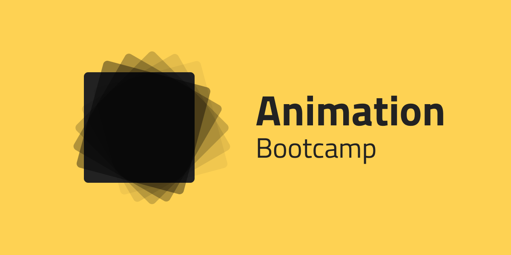

# CSS Animation Bootcamp

## Animation Bootcamp

### Four corners

* Gör en fyrkant på 500 x 500px centrerad på skärmen. 
* Inuti denna ska du nu animera en kub som går från hörn till hörn. 
* För varje hörn ska den stanna upp och byta färg innan den fortsätter.

### Spinner

Gör en loader eller spinner som kan visas medan en sida eller del av sida laddas. Din spinner skall växla mellan 4 olika färger under ett varv.

### Stopwatch

Gör ett tidtagarur med en snurrande sekund- samt en minutvisare. 

